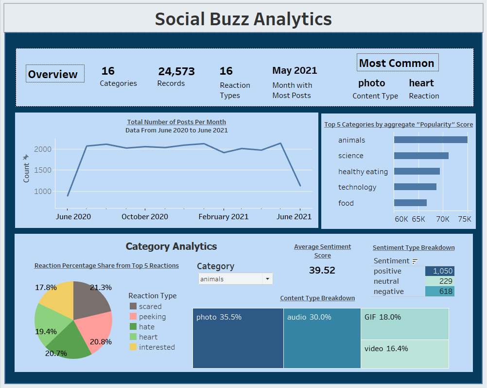

# ✨ Social Buzz Content Analysis

## About the project:
Social Buzz is a fictional social media platform that emphasizes content by keeping all users anonymous, only tracking user reactions to every piece of content. Over the past 5 years, Social Buzz has reached over 500 million active users each month. 
Of the 250 people working at Social Buzz, 200 are technical staff working on maintaining this highly complex technology. They seek our expertise to understand the massive amount of data they have gathered. 

They are specifically looking for an analysis of their content categories, showing the top 5 categories with the largest popularity. *Reaction*, *Content*, and *ReactionTypes* as our relevant data sets.

## Key takeaways: 
- Every day, over 100,000 pieces of content are posted, ranging from text, images, videos, and GIFs.
- 36,500,000 pieces of content per year! However, the project focuses on analyzing about 25,000 pieces of content.
- There are 16 unique categories that each piece of content falls into, such as animals, science, and food.
- May 2021 is the month with the most posts.
- The top 5 categories with the largest popularity are animals, science, healthy eating, technology, and food.
  
## Recommendations:
- People enjoy real-world content because the most popular category is animals, and food/healthy eating makes up a considerable percentage.
- So, the company can collaborate with influencers and brands to promote healthy eating and produce content related to animals on the platform to boost user engagement.

The dashboard can be viewed [here](https://public.tableau.com/app/profile/sai.sravani.sure/viz/SocialBuzz_17083481471150/Dashboard1).

## About the dataset:
*Reaction*, *Content*, and *ReactionTypes* as our relevant data sets. The dataset contains information about 25,000 pieces of content.

The *Content* table has the following data: 
  - ID: Unique ID of the content that was uploaded (automatically generated)
  - User ID: Unique ID of a user that exists in the User table
  - Type: A string detailing the type of content that was uploaded
  - Category: A string detailing the category that this content is relevant to
  - URL: Link to the location where this content is stored

The *Reaction* table has the following data: 
  - Content ID: Unique ID of a piece of content that was uploaded
  - User ID: Unique ID of a user that exists in the User table who reacted to this piece of content
  - Type: A string detailing the type of reaction this user gave
  - Datetime: The date and time of this reaction

The *ReactionTypes* table has the following data: 
  - Type: A string detailing the type of reaction this user gave
  - Sentiment: A string detailing whether this type of reaction is considered as positive, negative, or neutral
  - Score: This is a number calculated by Social Buzz that quantifies how “popular” each reaction is. A reaction type with a higher score should be considered as a more popular reaction.

## Procedure:
* Clean the dataset by
  - removing rows that have values that are missing
  - changing the data type of some values within a column
* Create a final data set by merging all three tables 
* Create a Tableau Dashboard with relevant visualizations to provide recommendations

## Tools used:
* Tableau
* Excel

#### The project was completed through the Accenture North America Data Analytics and Visualization Job Simulation on Forage. The certificate of completion can be found [here](Accenture.pdf).
